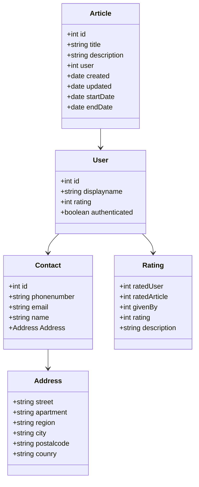

```mermaid
classDiagram
class Article {
+int id
+string title
+string description
+int user
+date created
+date updated
+date startDate
+date endDate
}
class User {
+int id
+string displayname
+int rating
+boolean authenticated
}
class Contact {
+int id
+string phonenumber
+string email
+string name
+Address Address
}
class Address {
+string street
+string apartment
+string region
+string city
+string postalcode
+string counry
}

class Rating {
+int ratedUser
+int ratedArticle
+int givenBy
+int rating
+string description
}
Article --> User
User --> Contact
Contact --> Address
User --> Rating
```